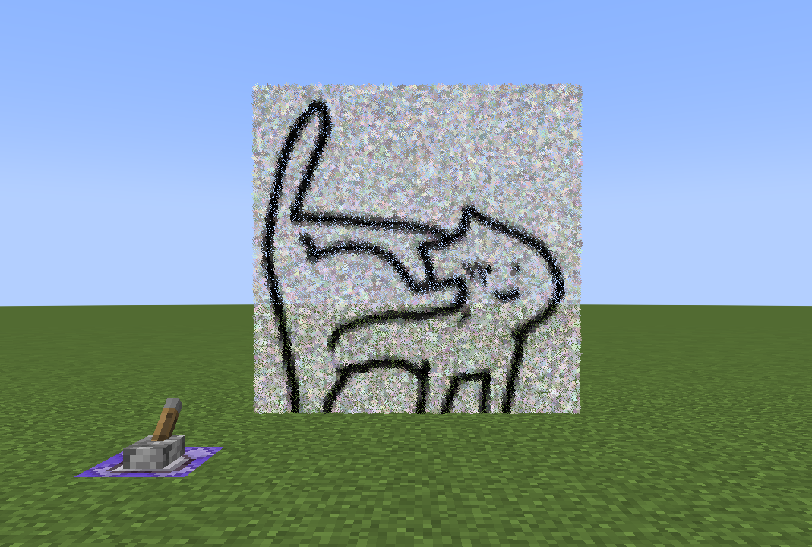

<div align="center">



# Minecraft Media Player


可以让您在Minecraft中播放视频和图片的Python脚本

`数据包理论支持1.13+`


*** 

</div>

[English](https://github.com/Miaoywww/Minecraft-Media-Player/blob/main/README.md) | **中文**

## 下载

通过Git克隆到计算机或在github上下载

``` 
git clone https://github.com/Miaoywww/Minecraft-Media-Player.git
```

安装所需库

```
pip install -r requirements.txt
```

**若您需要对视频进行处理, 请手动安装opencv, 由于opencv太大, 我没有把它放在requirements.txt中**

```
pip install opencv-python
```

## 使用

> `/` 是必须的, 我建议将处理文件放在 `main/` 中

```
# 对于图片的处理
python3 images.py ./cat.jpg

# 对于视频的处理
python3 videos.py ./video.mp4
```

运行之后在 `functions/` 中找到你的数据包, 应用你的数据包

## 注意

对于宽高过大的图片和视频我建议将其压缩再使用

因为Minecraft的粒子数量是`有上限的`, 因此它不可能完整显示一个非常大的图片( 帧 )

关于大体积数据包, 我自己反正是没有加载成功过, 若您的电脑比我的好上很多, 可以尝试一下

我的电脑配置:

+ CPU: i5 9400F
+ RAM: DDR4 2400Mhz 8G
+ GPU: RX580 2048sp

## License

Copyright Miaomiaoywww 2022. 

Distributed under the terms of the [MIT license](https://github.com/Miaoywww/Minecraft-Media-Player/blob/main/LICENSE).
